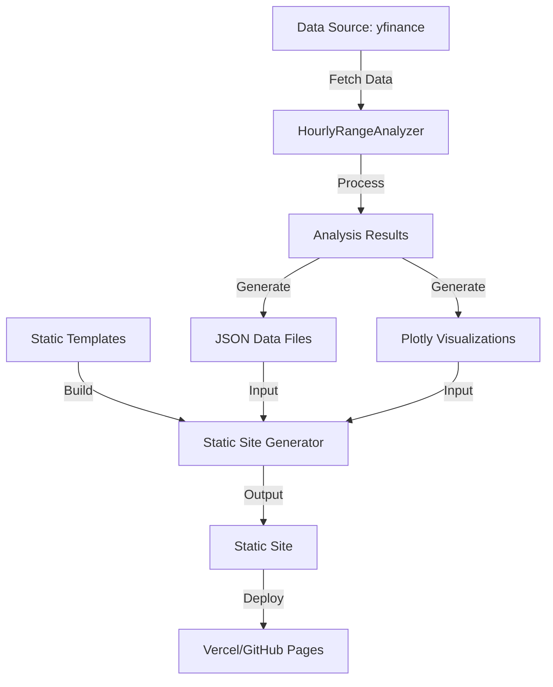
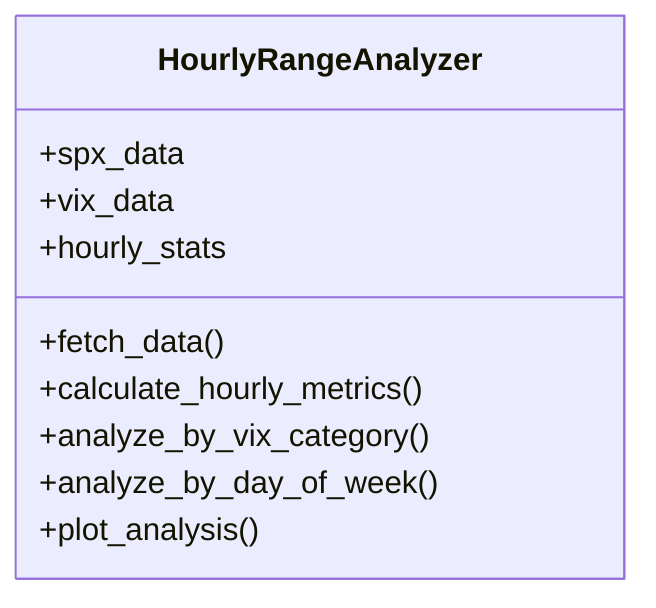
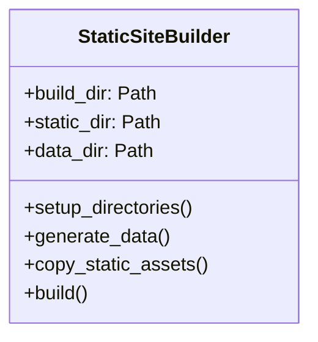
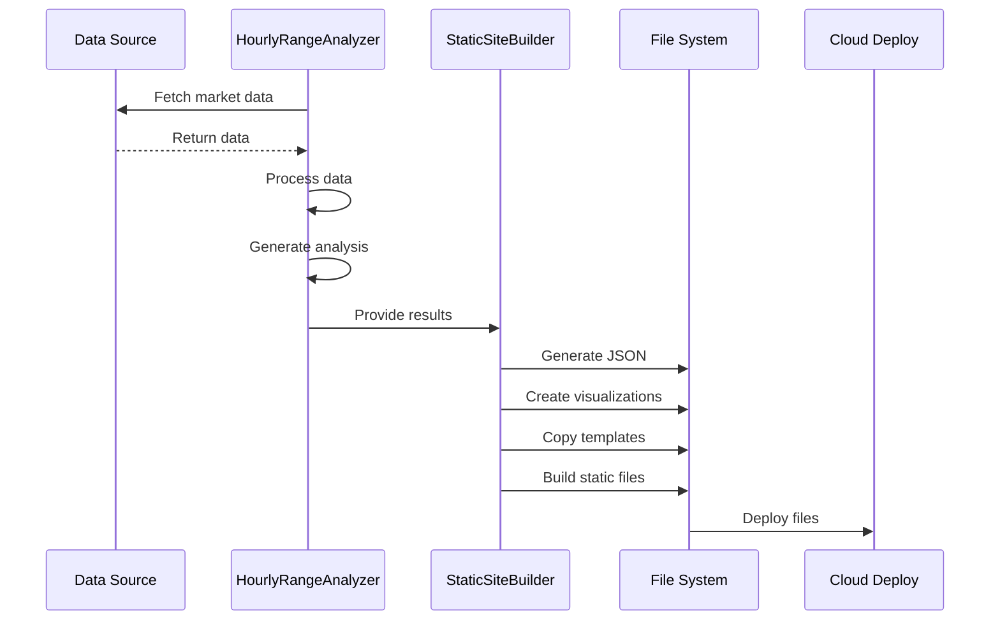

# Architecture Overview

This document outlines the architecture and data flow of the Market Lens hourly analysis static site generator.

## System Architecture



## Component Architecture

### 1. Data Layer

**HourlyRangeAnalyzer**
- Responsible for data fetching and analysis
- Handles market data processing
- Generates statistical analyses
- Creates visualizations



### 2. Build Layer

**StaticSiteBuilder**
- Manages build process
- Handles file operations
- Coordinates data generation
- Manages asset pipeline



### 3. Frontend Layer

**Static Site**
- Client-side rendering
- Data visualization
- User interface
- Responsive design

## Data Flow



## Directory Structure

```
market-lens/
├── src/
│   └── hourly_analysis/
│       ├── build.py                # Static site generator
│       ├── hourly_range_analyzer.py # Analysis engine
│       └── templates/              # Frontend templates
├── build/                         # Build output
│   ├── data/                     # Generated data
│   ├── static/                   # Static assets
│   └── index.html               # Entry point
└── docs/                        # Documentation
```

## Key Design Decisions

### 1. Static Site Generation
- **Why**: Improved performance, simpler hosting, better security
- **Trade-offs**: 
  - Pro: No server maintenance
  - Con: Data not real-time

### 2. Data Processing
- **Why**: Separate concerns, maintainable code
- **Trade-offs**:
  - Pro: Clear separation of responsibilities
  - Con: Additional build step

### 3. Client-Side Rendering
- **Why**: Interactive visualizations, dynamic updates
- **Trade-offs**:
  - Pro: Rich user experience
  - Con: Initial load time

## Security Considerations

1. **Data Access**
   - Public data only
   - No sensitive information in build
   - Rate limiting consideration

2. **Build Process**
   - Sanitized data output
   - Validated input
   - Secure dependencies

3. **Deployment**
   - HTTPS only
   - Content security policy
   - Asset integrity

## Performance Optimization

1. **Build Optimization**
   - Minified output
   - Optimized images
   - Compressed data

2. **Load Time**
   - Lazy loading
   - Asset preloading
   - Cache headers

3. **Runtime**
   - Efficient DOM updates
   - Optimized calculations
   - Memory management

## Future Considerations

1. **Scalability**
   - Automated builds
   - Parallel processing
   - Distributed hosting

2. **Features**
   - Additional analyses
   - More visualizations
   - API integration

3. **Maintenance**
   - Monitoring
   - Error tracking
   - Performance metrics

## Dependencies

1. **Core**
   - Python 3.x
   - yfinance
   - Plotly

2. **Build**
   - Static site generator
   - Asset pipeline

3. **Deployment**
   - Vercel
   - GitHub Pages
