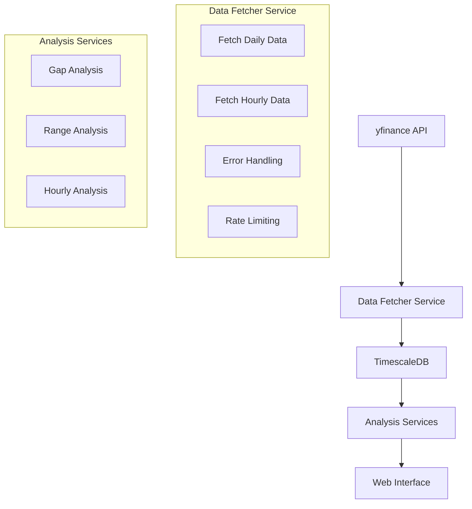

# Market Lens Database Implementation Plan

## Overview
This document outlines the plan for implementing a unified database solution for Market Lens, standardizing data fetching and storage for both daily and hourly market data.

## Goals
1. Implement TimescaleDB for efficient time-series data storage
2. Standardize data fetching using yfinance
3. Support both hourly and daily data analysis
4. Improve data reliability and consistency

## Database Design

### Schema
```sql
-- Main time-series table
CREATE TABLE market_data (
    time TIMESTAMPTZ NOT NULL,
    symbol TEXT NOT NULL,
    open DECIMAL NOT NULL,
    high DECIMAL NOT NULL,
    low DECIMAL NOT NULL,
    close DECIMAL NOT NULL,
    volume BIGINT,
    interval TEXT NOT NULL,  -- 'hourly' or 'daily'
    PRIMARY KEY (time, symbol, interval)
);

-- Convert to TimescaleDB hypertable
SELECT create_hypertable('market_data', 'time');

-- Materialized view for first hour stats
CREATE MATERIALIZED VIEW first_hour_stats AS
SELECT 
    date_trunc('day', time) as date,
    symbol,
    first(open, time) as first_hour_open,
    max(high) as first_hour_high,
    min(low) as first_hour_low,
    last(close, time) as first_hour_close
FROM market_data
WHERE 
    interval = 'hourly'
    AND extract(hour from time) = 9  -- First trading hour
GROUP BY date_trunc('day', time), symbol;
```

## Implementation Phases

### Phase 1: Database Setup (1-2 days)
- [ ] Install TimescaleDB
- [ ] Create database schema
- [ ] Set up user permissions
- [ ] Configure backup strategy

### Phase 2: Unified Data Fetcher (1-2 days)
- [ ] Create UnifiedDataFetcher class
- [ ] Implement error handling
- [ ] Add rate limiting
- [ ] Add data validation
- [ ] Implement database storage methods

### Phase 3: Database Integration (2-3 days)
- [ ] Implement TimescaleDB connection handling
- [ ] Create data models
- [ ] Set up indexes
- [ ] Implement data integrity checks
- [ ] Add database migration scripts

### Phase 4: Code Updates (2-3 days)
- [ ] Update analysis modules to use new fetcher
- [ ] Remove NASDAQ API code
- [ ] Update tests
- [ ] Add monitoring
- [ ] Update documentation

### Phase 5: Data Migration (1-2 days)
- [ ] Migrate historical data
- [ ] Validate data consistency
- [ ] Perform data quality checks
- [ ] Update documentation

## New Data Architecture



## Code Changes

### New Unified Data Fetcher
```python
class UnifiedDataFetcher:
    def __init__(self, db_connection):
        self.db = db_connection
        
    def fetch_data(self, symbol: str, interval: str = '1d', period: str = '1y'):
        """
        Smart data fetching that only downloads missing or new data
        
        Args:
            symbol: Stock/Index symbol
            interval: 1d, 1h, etc.
            period: 1d, 5d, 1mo, 3mo, 6mo, 1y, 2y, 5y, 10y, ytd, max
        """
        # Get latest data point from DB
        latest_time = self._get_latest_time(symbol, interval)
        
        if latest_time is None:
            # No data in DB, fetch full period
            ticker = yf.Ticker(symbol)
            data = ticker.history(period=period, interval=interval)
        else:
            # Calculate period needed for new data only
            start_time = latest_time + pd.Timedelta(self._get_interval_delta(interval))
            if start_time >= pd.Timestamp.now():
                return None  # Data is already up to date
            
            ticker = yf.Ticker(symbol)
            data = ticker.history(start=start_time, interval=interval)
            
        if data.empty:
            return None
            
        return self._store_in_db(symbol, interval, data)
        
    def _get_latest_time(self, symbol: str, interval: str) -> Optional[pd.Timestamp]:
        """Get the timestamp of the latest data point in DB."""
        query = """
            SELECT MAX(time) 
            FROM market_data 
            WHERE symbol = %s AND interval = %s
        """
        # Execute query and return timestamp
        pass
        
    def _get_interval_delta(self, interval: str) -> str:
        """Convert interval string to timedelta string."""
        mapping = {
            '1h': 'hours=1',
            '1d': 'days=1',
            # Add more intervals as needed
        }
        return mapping.get(interval, 'days=1')
        
    def _store_in_db(self, symbol: str, interval: str, data: pd.DataFrame):
        """Transform and store data in TimescaleDB."""
        # Implement upsert to handle any overlapping data points
        query = """
            INSERT INTO market_data (time, symbol, open, high, low, close, volume, interval)
            VALUES (%s, %s, %s, %s, %s, %s, %s, %s)
            ON CONFLICT (time, symbol, interval) 
            DO UPDATE SET
                open = EXCLUDED.open,
                high = EXCLUDED.high,
                low = EXCLUDED.low,
                close = EXCLUDED.close,
                volume = EXCLUDED.volume
        """
        # Execute query for each row in data
        pass
```

## Dependencies
```
yfinance==0.2.36      # Unified data fetching
psycopg2-binary==2.9.9  # PostgreSQL adapter
sqlalchemy==2.0.0      # SQL toolkit
pandas==2.2.0         # Data processing
```

## Benefits
1. Single source of truth for market data
2. Improved data reliability and consistency
3. Efficient time-series data storage and querying
4. Simplified maintenance and monitoring
5. Better error handling and rate limiting
6. Unified data format across the application
7. Smart data fetching to minimize API calls
8. Automatic handling of data gaps and updates
9. Efficient storage with no duplicate data

## Progress Tracking

### Current Status
- [x] Phase 1: Completed
  - Installed TimescaleDB
  - Created market_lens database
  - Created market_data hypertable
  - Created first_hour_stats materialized view
- [x] Phase 2: Completed
  - Created DatabaseConnector class for connection management
  - Implemented UnifiedDataFetcher with smart data fetching
  - Added data validation and error handling
  - Implemented efficient data storage with upsert operations
  - Added database query methods for data retrieval
- [x] Phase 3: Completed
  - Implemented proper timezone handling
  - Added smart data fetching that only downloads new data
  - Added rate limiting and error handling
  - Verified data integrity with test cases
  - Successfully tested with both daily and hourly data
- [ ] Phase 4: Not Started
- [ ] Phase 5: Not Started

### Updates
2025-02-26:
- Completed Phase 1: Database Setup
  - Installed PostgreSQL 17 and TimescaleDB
  - Created market_lens database with TimescaleDB extension
  - Created market_data hypertable with time-series optimization
  - Created materialized view for first hour statistics
  - Verified database schema and extensions

- Completed Phase 2: Unified Data Fetcher
  - Created src/database package with proper structure
  - Implemented DatabaseConnector for connection management
  - Created UnifiedDataFetcher with smart data fetching
  - Added support for both hourly and daily data
  - Implemented efficient data storage with upsert operations
  - Added data validation and error handling
  - Updated requirements.txt with new dependencies

- Completed Phase 3: Database Integration
  - Fixed timezone handling for all timestamps
  - Implemented smart data fetching to minimize API calls
  - Added rate limiting to prevent API throttling
  - Added comprehensive error handling and logging
  - Successfully tested with SPY and VXX data
  - Verified data integrity in TimescaleDB

## Next Steps
1. Begin with Phase 1: Database Setup
2. Set up development environment with TimescaleDB
3. Create initial database schema
4. Start implementing UnifiedDataFetcher

## Notes
- Regular progress updates will be added to this document
- Each phase should be tested thoroughly before moving to the next
- Consider adding monitoring and alerting for data quality
